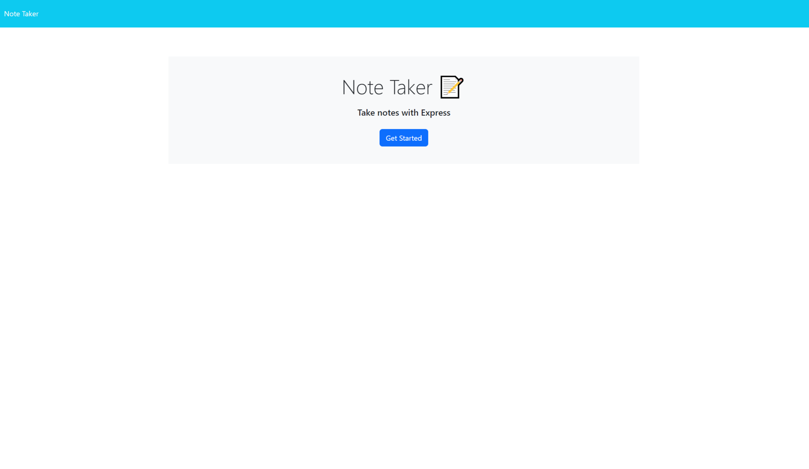
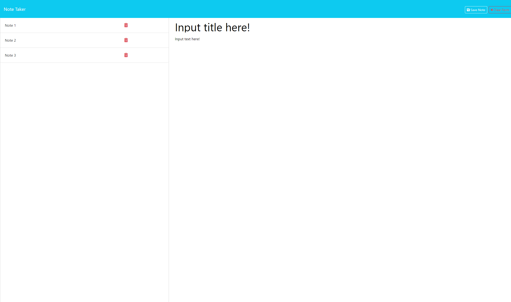

## Note Taker

  # License
  
  
## Description

  - deployed site: https://notes-taker-75m7.onrender.com
  
  - Take notes, save notes, and delete notes!

  
  
  
## Table of Contents
  
  - [Installation](#installation)
  - [Features](#features)
  - [Questions](#questions)
  
## Installation
  
  - In your terminal, run "npm i" to install the necessary packages.

  - Then run "npm start" to run the app.
  
## Features
  
 - Take notes,
 
 - Save notes
 
 - Delete notes!
  
## Questions
  
  - https://github.com/crissal2
  
  - salgado.chris.m@gmail.com
  
